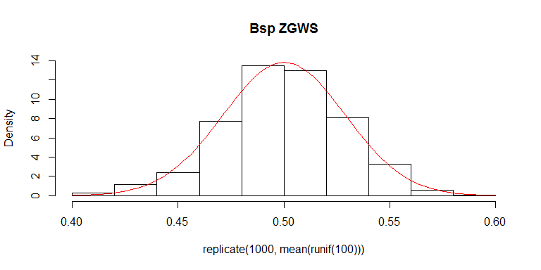

# Konstrukte und vektorwertiges Programmieren


## Bedingte Anweisungen

Für bedingte Anweisungen gibt es in R die beiden Konstrukte


```r
> if (bedingung){ausdruck1} else {ausdruck2}
> ifelse(bedingung, vektor1, vektor2)
```

Mit `if ... else` können sehr komplexe Ausdrücke gewählt werden. Die `bedingung` darf hier allerdings *nicht* vektorwertig sein. Die `if ... else` Konstruktion kann natürlich auch geschachtelt werden.

`ifelse` erlaubt eine vektorwertige Bedingung. Je nach logischem Wert wird das entsprechende Element von `vektor1` oder `vektor2` gewählt.


```r
> a <- 1
> if(exists("a", mode = "numeric")) {
+   a <- a + 1
+ } else {
+   a <- 1
+ }
> a
```

```
## [1] 2
```

```r
> rm(a)
> if(exists("a", mode = "numeric")) {
+   a <- a + 1
+ } else {
+   a <- 1
+ }
> a
```

```
## [1] 1
```


`ifelse` kann, wie schon gesagt, vektorwertig arbeiten. So kann für jeden Eintrag eine Bedingung überprüft werden und abhängig vom Ausgang der Überprüfung ein Ergebnis berechnet werden.


```r
> x <- sample(-5:5, size = 7, replace = TRUE)
> ifelse(x > 0, x^2, 0)
```

```
## [1]  0  0  0 16  1  0 16
```

Man beachte, dass beide Vektoren ausgewertet werden, wie man hier sieht

```r
> ifelse(x < 0, x^2, sqrt(x))
```

```
## Warning in sqrt(x): NaNs wurden erzeugt
```

```
## [1] 16  9 16  2  1  0  2
```

## Schleifen

Schleifen erlauben den wiederholten Aufruf (in größerer Anzahl) einer Reihe von Befehlen. Diese können dabei iterativ voneinander abhängen (durch die verwendeten Inputgrößen).

Schleife bzw. Kontrollwert | Beschreibung |
---------------------------|-------------|
`repeat{ausdruck}` | wiederhole `ausdruck`|
`while(bedingung){ausdruck}` | wiederhole `ausdruck`,  solange `bedingung` erfüllt|
`for(i in M){ausdruck}` | wiederhole `ausdruck` $$\forall i\in M$$ |
`next` | springe in den nächsten Schritt|
`break`| beende die Schleife|


Die einfachste Form einer Schleife ist aber `replicate()`.


```r
> hist(replicate(1000, mean(runif(100))), main = "Bsp ZGWS", freq = FALSE, ylim = c(0,14))
> curve(dnorm(x, mean = 0.5, sd = 1/sqrt(12*100)), 
+       from = 0.4, to = 0.6,  col = "red",add = TRUE)
```

 


## Konstrukte: Schleifen

Hier ein paar Beispiele zu den drei Schleifen-Typen. Diese dienen nur zur Demonstration, da deren Output wenig sinnvoll ist.

##### `repeat()`


```r
> i <- 0 
> repeat{
+   i <- i + 1
+   print(i)
+   if(i < 2) next
+   i <- 2*i
+   print(i)
+   if(i > 6) break
+ }
```

```
## [1] 1
## [1] 2
## [1] 4
## [1] 5
## [1] 10
```


##### `while()`


```r
> while(i > 1){ 
+   i <- i-1
+   print(i)
+ }
```

```
## [1] 9
## [1] 8
## [1] 7
## [1] 6
## [1] 5
## [1] 4
## [1] 3
## [1] 2
## [1] 1
```

##### `for()`


```r
> x <- 1:10
> z <- NULL
> for(i in seq(along = x)) {
+     if (x[i] < 5) {
+         z <- c(z, x[i] - 1) 
+     } else {
+         stop("Wert muss kleiner als 5 sein")
+     }
+ }
```

```
## Error in eval(expr, envir, enclos): Wert muss kleiner als 5 sein
```

```r
> z
```

```
## [1] 0 1 2 3
```

Für eine `for` Schleife entlang eines Vektors `x` sollte man nicht `for(i in 1:length(x))` verwenden, da


```r
> x <- NULL
> for(i in 1:length(x)) print(x[i])
```

```
## NULL
## NULL
```

```r
> for(i in seq(along = x)) print(x[i])
```

> **Bemerkung:** Schleifen sind, wenn möglich, zu vermeiden. R ist ein interpretierte Sprache, d.h. jeder Befehl wird zur Laufzeit interpretiert. Somit wird jeder Befehl in einer Schleife bei jedem Durchlauf neu interpretiert.

## Vektorwertig Programmieren und Schleifen

Es sollte so oft wie möglich vektorwertig programmiert werden. 

*Einschränkung*: Fälle, in denen durch vektorwertiges und/oder rekursives Programmieren ein zu hoher Speicherbedarf entsteht. Hier können Schleifen wieder sinnvoll sein.


Benutzt man Schleifen, sollt man auf folgende Punkte achten:

- Objekte zu Beginn initialisieren


```r
> x <- matrix(rnorm(1000000), 100000, 10 )
> mittelwerte_x <- NULL
> system.time(for(i in seq(along = x[, 1])) 
+   mittelwerte_x <- c(mittelwerte_x, mean(x[i, ])))
```

```
##    user  system elapsed 
##   17.50    0.10   17.63
```

```r
> mittelwerte_x <- numeric(length(x[, 1]))
> system.time(for(i in seq(along = x[, 1])) 
+   mittelwerte_x[i] <- mean(x[i, ]))
```

```
##    user  system elapsed 
##    0.64    0.00    0.64
```

- Keine unnötigen Fehlerüberprüfungen in Schleifen durchführen
- Keine Berechnung mehrfach ausführen (sollte man nie)


```r
> n <- 10000
> x <- rnorm(n)
> a <- numeric(n)
> system.time(for(i in 1:n) a[i] <- 2 * mean(x) * pi * sin(3 * i))
```

```
##    user  system elapsed 
##    0.32    0.00    0.33
```

```r
> system.time({for(i in 1:n) a[i] <- sin(3 * i)
+              a <- 2 * mean(x) * pi * a})
```

```
##    user  system elapsed 
##    0.01    0.00    0.01
```


Neben Laufzeitvorteilen vektorwertiger Operationen


```r
> system.time(for(i in 1:n) a[i] <- 2 * mean(x) * pi * sin(3 * i))
```

```
##    user  system elapsed 
##    0.32    0.00    0.31
```

```r
> system.time(a <- 2 * mean(x) * pi * sin(3 * (1:n)))
```

```
##    user  system elapsed 
##       0       0       0
```

sind diese oftmals leichter verständlich.  
In der folgenden Tabelle sind einige Funktionen aufgelistet, die zum vektorwertigen Programmieren verwendet werden können.

Funktion | Beschreibung 
---------|--------------
`%*%` | Vektor- oder Matrixmultiplikation 
`%o%, outer()` | äußeres Produkt 
`%x%, kronecker()` | Kronecker-Produkt
`colSums(), rowSums()` | schnelle Spalten-, Zeilensummen
`colMeans(), rowMeans()` | schnelle Spalten-, Zeilenmittel 
`apply()` | spalten- und zeilenweise Funktionen auf Matrizen und Arrays anwenden
`lapply()` | elementweise Funktionen auf Listen anwenden
`sapply()` | wie `lapply()` mit "vereinfachter" Ausgabe
`mapply()` | multivariates `sapply()`
`tapply()`  | Funktionen auf "gruppierbare" Vektoren anwenden


Die Funktion `apply()` lässt sich z.B. folgendermaßen nutzen zur Berechnung von Mittelwerten der Spalten (oder Zeilen) einer Matrix bzw. zur Mittelung über die jeweiligen Einträge von mehreren Matrizen.


```r
> str(apply)
```

```
## function (X, MARGIN, FUN, ...)
```

```r
> x <- matrix(rnorm(200), nrow = 20, ncol = 5)
> apply(x, MARGIN = 2, FUN = mean)
```

```
## [1]  0.12791559 -0.08395936 -0.14192528 -0.22353197  0.50435694
```

```r
> a <- array(rnorm(2 * 2 * 10), dim = c(2, 2, 5))
> apply(a, MARGIN = c(1, 2), FUN = mean)
```

```
##            [,1]       [,2]
## [1,] -0.1284584 -0.4842267
## [2,]  0.2311143  0.1106028
```


Die Funktionen `rowSums(), colSums(), rowMeans()` und `colMeans()` sind Abkürzungen der `apply()` Funktion mit `FUN` gleich `sum` oder `mean`. Diese Abkürzungen können deutlich schneller sein.


```r
> x <- matrix(rnorm(1000000), 100000, 10)
> system.time(mittelwerte_x <- apply(x, 1, mean))
```

```
##    user  system elapsed 
##    0.71    0.02    0.73
```

```r
> system.time(mittelwerte_x <- rowMeans(x))
```

```
##    user  system elapsed 
##       0       0       0
```


Arbeitet man mit Listen, wie z.B.


```r
> str(lapply)
```

```
## function (X, FUN, ...)
```

```r
> head(iris)
```

```
##   Sepal.Length Sepal.Width Petal.Length Petal.Width Species
## 1          5.1         3.5          1.4         0.2  setosa
## 2          4.9         3.0          1.4         0.2  setosa
## 3          4.7         3.2          1.3         0.2  setosa
## 4          4.6         3.1          1.5         0.2  setosa
## 5          5.0         3.6          1.4         0.2  setosa
## 6          5.4         3.9          1.7         0.4  setosa
```

```r
> iris_list <- as.list(iris[, 1:4])
```


so gibt es spezielle Funktionen aus der "apply Familie", die speziell (aber nicht nur) zur Anwendung auf Listen vorgesehen sind, wie z.B. `lapply()` oder `sapply()`.


```r
> lapply(iris_list, FUN = mean)
```

```
## $Sepal.Length
## [1] 5.843333
## 
## $Sepal.Width
## [1] 3.057333
## 
## $Petal.Length
## [1] 3.758
## 
## $Petal.Width
## [1] 1.199333
```

```r
> sapply(iris_list, FUN = mean)
```

```
## Sepal.Length  Sepal.Width Petal.Length  Petal.Width 
##     5.843333     3.057333     3.758000     1.199333
```

Will man eine Funktion auf mehrere Listen anwenden, so bietet sich `mapply()` an.

```r
> str(mapply) # FUN ist das erste Argument
```

```
## function (FUN, ..., MoreArgs = NULL, SIMPLIFY = TRUE, USE.NAMES = TRUE)
```

```r
> mapply(FUN = sum, 1:10, 10:1, 5)
```

```
##  [1] 16 16 16 16 16 16 16 16 16 16
```

Möchte man hingegen eine Funktion auf die einzelnen Elemente einer Gruppe in einer vorgegebenen Gruppierung anwenden, so verwendet man `tapply()`.


```r
> str(tapply) # INDEX Liste von Faktoren 
```

```
## function (X, INDEX, FUN = NULL, ..., simplify = TRUE)
```

```r
> tapply(iris$Petal.Length, INDEX = iris$Species, 
+        FUN = mean)
```

```
##     setosa versicolor  virginica 
##      1.462      4.260      5.552
```
Berechnet wurden also die empirischen Mittelwerte von `Petal.Length` in den drei Gruppen `setosa, versicolor` und `virginica`.


