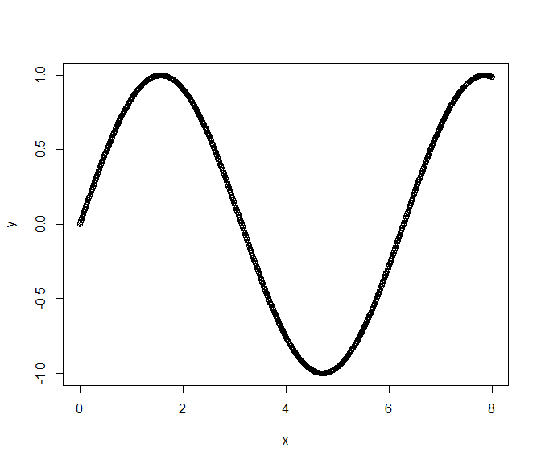
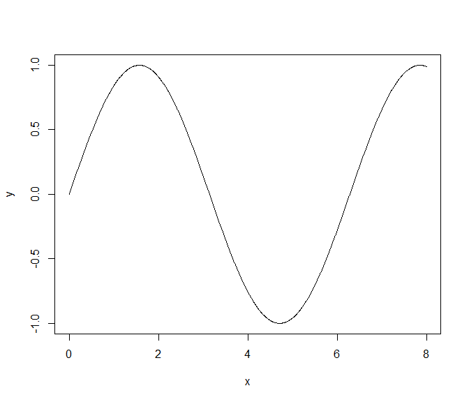
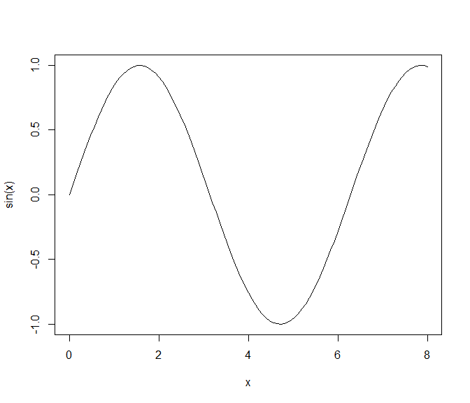
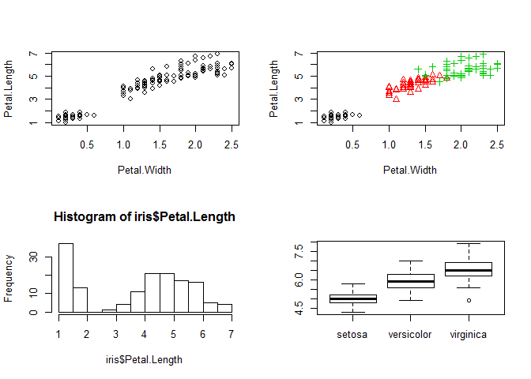
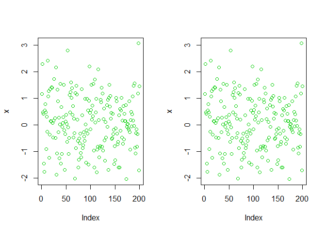
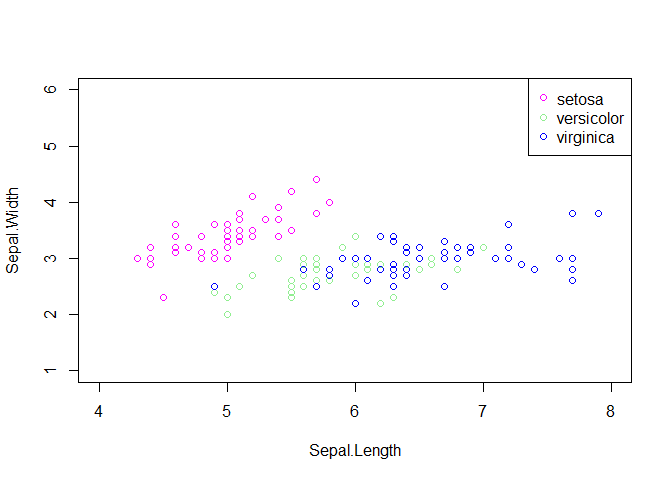

# Standard-Grafiksystem


Dieser Abschnitt gibt eine kurze Einführung in das Standard-Grafiksystem von R.

Wenn eine Grafik erzeugt wird, muss geklärt werden auf welchem **Device** die Ausgabe erfolgen soll. Standardeinstellung ist die Bildschirmgrafik. Die wichtigsten Möglichkeiten sind die folgenden:


Funktion | Beschreibung
---------|-------------
`jpeg()` | JPEG
`pdf()` | PDF
`png()` | PNG
`postscript()` | PostScript
`X11()` | Bildschirmgrafik


Devices sind wie Papier auf das gemalt wird. Einmal erzeugte Elemente lassen sich nicht löschen, sondern nur weiter übermalen. 


```r
> x <- seq(0, 8, length = 1000)
> y <- sin(x)
> plot(x, y)
```



Für dieses Beispiel scheint uns die Standardausgabe (Kreissymbole) nicht passend zu sein. Wir würden viel lieber die Sinusfunktion als durchgezogene Linie sehen. Daher müssen wir den `type` ändern.


```r
> plot(x, y, type = "l")
```




## High-level Grafikfunktionen

Bei Grafikfunktionen unterscheidet man zwischen High- und [Low-level](Standard-Grafiksystem.html/#low-level-grafikfunktionen) Grafikfunktionen. Erstere sind im Unterschied zu Letzteren in der Lage ein neues Grafikfenster zu öffnen. Mithilfe von Low-level Grafikfunktionen kann man nur neu Grafikelemente in ein bereits geöffnetes Grafikfenster hinzufügen. Die wichtigsten High-level Grafikfunktionen sind in nachfolgender Tabelle zusammengefasst.

Funktion | Beschreibung
---------|--------------
`plot()` | generische Funktion mit vielen Methoden
`barplot()` | Stabdiagramm
`boxplot()` | Boxplot
`contour()` | Höhenlinien-Plot
`coplot()` | Conditioning-Plot
`curve()` | Funktionen zeichnen
`dotchart()` | ''Punkte Plot''
`hist()` | Histogramm
`image()` | Bilder (3. Dim. als Farbe)
`pairs()` | Streudiagramm-Matrix
`persp()` | perspektivische Flächen
`qqplot()` | QQ-Plot


Laut Tabelle eignet sich `curve()` zum plotten von Funktionen. Daher erzeugen wir die letzte Grafik erneut mit der Funktion `curve()`.


```r
> curve(sin(x), from = 0, to = 8)
```




### Beispiele anhand der iris Daten

Wir betrachten ein paar Beispiele von High-level Grafikfunktionen. Diese wenden wir auf den `iris` Datensatz an.

```r
> data(iris)
> head(iris)
```

```
##   Sepal.Length Sepal.Width Petal.Length Petal.Width Species
## 1          5.1         3.5          1.4         0.2  setosa
## 2          4.9         3.0          1.4         0.2  setosa
## 3          4.7         3.2          1.3         0.2  setosa
## 4          4.6         3.1          1.5         0.2  setosa
## 5          5.0         3.6          1.4         0.2  setosa
## 6          5.4         3.9          1.7         0.4  setosa
```

Zuerst verwenden wir `plot()` mithilfe der Formelnotation `~`, erzeugen ein Histogramm und erstellen anschließend einen Boxplot.


```r
> par(mfrow = c(2, 2))
> plot(Petal.Length ~ Petal.Width, data = iris)
> plot(Petal.Length ~ Petal.Width, data = iris, pch = as.numeric(Species), 
+      col = as.numeric(Species))
> hist(iris$Petal.Length)
> boxplot(iris$Sepal.Length ~ iris$Species)
```




## Konfigurierbarkeit

Globale Grafikeinstellungen können mit `par()` festgelegt werden. Einstellungen für eine einzelne Grafik können direkt der Grafikfunktion übergeben werden.


Argument | Beschreibung
---------|---------------
`axes` | Achsen sollen (nicht) eingezeichnet werden
`bg` | Hintergrundfarbe
`cex` | Größe eines Punktes bzw. Buchstaben
`col` | Farben
`las` | Ausrichtung der Achsenbeschriftung
`log` | Logarithmierte Darstellung
`lty`, `lwd` | Linientyp, Linienbreite
`main`, `sub` | Grafiküberschrift, -unterschrift
`mfcol`, `mfrow` | mehrere Grafiken in einem Bild
`pch` | Symbol für einen Punkt
`type` | Typ (`l`: Linie, `p`: Punkt, `b`: beides, `n`: nichts)
`xlab`, `ylab` | x-/y-Achsenbeschriftung
`xlim`, `ylim` | zu plottender Bereich in x-/y-Richtung

## Farben

Farben können auf verschiedene Art und Weise angegeben werden. Entweder über den Farbnamen (falls bekannt) oder die zugehörige Stelle in der aktuellen Farbpalette. Eine ganze Zahl bezeichnet die Farbe an entsprechender Stelle in der aktuellen
Farbpalette.


```r
> palette()
```

```
## [1] "black"   "red"     "green3"  "blue"    "cyan"    "magenta" "yellow" 
## [8] "gray"
```

green3 steht also an der dritten Stelle der Farbpalette. Daher liefen die beiden nachfolgenden Befehle auch das gleiche Ergebnis.


```r
> x <- rnorm(200)
> par(mfrow = c(1, 2))
> plot(x, col = 3)
> plot(x, col = "green3")
```




## Low-level Grafikfunktionen

Mit Low-level Grafikfunktionen können Elemente (wie z.B. Punkte, Linien, Beschriftungen) zu einer bestehenden Grafik hinzugefügt werden. Ebenso können Grafiken initialisiert werden. Sie dienen damit also als Grundlage und zur Erweiterung von High-level Grafiken.


Funktion | Beschreibung
---------|--------------
`abline()` | ''intelligente'' Linie
`arrows()` | Pfeile
`axis()` | Achsen
`grid()` | Gitternetz
`legend()` | Legende
`lines()` | Linien
`plot.new()` | Grafik initialisieren
`points()` | Punkte
`polygon()` | (ausgefüllte) Polygone
`text()` | Text
`title()` | Beschriftung


Mit `points()` können wir also Punkte zu einem bereits bestehenden Plot hinzufügen und mit `legend()` sind
wir in der Lage eine Legende anzugeben.


```r
> plot(Sepal.Width ~ Sepal.Length, data = iris, subset = iris$Species=="setosa", 
+      xlim = c(4, 8), ylim = c(1, 6),col = 14)
> points(Sepal.Width ~ Sepal.Length, data = iris, subset = iris$Species == "versicolor",
+        col = "lightgreen")
> points(Sepal.Width ~ Sepal.Length, data = iris, subset = iris$Species == "virginica", 
+        col = "blue")
> legend("topright", legend = c("setosa", "versicolor", "virginica"),
+        pch = c(21, 21, 21), col = c(14, "lightgreen", "blue"))
```




Weitere Informationen über die grafischen Möglichkeiten in R findet man z.B. auf den Seiten

- http://en.wikibooks.org/wiki/R_Programming/Graphics
- http://vis.supstat.com/
- http://www.statmethods.net/advgraphs/trellis.html
- http://rgm3.lab.nig.ac.jp/RGM
