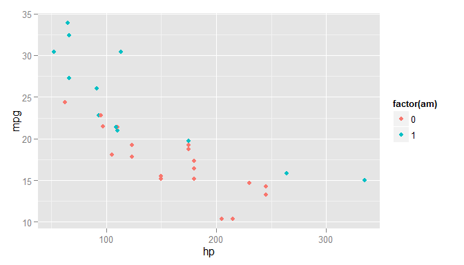
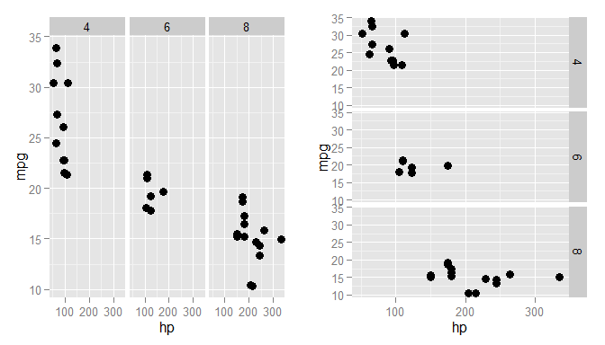

# Programmieren mit R: ggplot2


Das Paket `ggplot2` verwendet eine Grammatik beim Erzeugen von Grafiken. Diese basiert auf 

> [Wilkinson (2005): *The Grammar of Graphics*, Springer.](http://link.springer.com/book/10.1007%2F0-387-28695-0)

Dadurch

- ist eine starke Abstraktion bei der Definition einer Grafik möglich,
- steht ein sehr flexibles Grafiksystem zur Verfügung.

Zuerst installieren wir das Paket (falls noch nicht geschehen)


```r
> install.packages("ggplot2")
```

Die grundlegende Idee besteht darin die Bausteine eines Plots unabhängig voneinander zu definieren. Ein Plot besteht (kann bestehen) aus:

- den Daten (müssen immer als `data.frame` angegeben werden)
- einem Koordinatensystem
- einer Skala 
- einem geometrischen Objekt zur Darstellung der Daten (`geom`)
- einer statistische Transformation der Daten (`stat`) - falls dies gewünscht ist
- ....

Die einzelnen Teile eines Plots werden dann mit dem `+` Operator zusammengefügt. Zur Initialisierung eines Plots können `qplot()` (<span style="color:#0072BD">q</span>uick <span style="color:#0072BD">plot</span>) und `ggplot()` (<span style="color:#0072BD">g</span>rammar of <span style="color:#0072BD">g</span>raphics <span style="color:#0072BD"> plot</span>) verwendet werden. Wir konzentrieren uns auf `ggplot()`. 

Die nachfolgenden Beispiel verwenden hauptsächlich den Datensatz


```r
> library(ggplot2)
> data(mtcars)
> head(mtcars, 4)
```

```
##                 mpg cyl disp  hp drat    wt  qsec vs am gear carb
## Mazda RX4      21.0   6  160 110 3.90 2.620 16.46  0  1    4    4
## Mazda RX4 Wag  21.0   6  160 110 3.90 2.875 17.02  0  1    4    4
## Datsun 710     22.8   4  108  93 3.85 2.320 18.61  1  1    4    1
## Hornet 4 Drive 21.4   6  258 110 3.08 3.215 19.44  1  0    3    1
```

um die verschiedenen Funktionalitäten darzustellen.


```r
> ggplot(data = mtcars, aes(x = wt, y = mpg)) +   geom_point()
```


## ggplot2 vs. Standardgrafik

Im Vergleich zur Standardgrafik (siehe [Anhang](anhang/standard-grafiksystem.html)) ist `ggplot2`

> aufwendiger bei **einfachen** Grafiken, weniger aufwendig bei **komplexeren** Grafiken und
besitzt keine Methoden (Daten sollten von Klasse `data.frame` sein)

Eine einfache Grafik, wie das Histogramm eines Datenvektors, erzeugt man im Standard-Grafiksystem mit folgendem Befehl


```r
> hist(mtcars$mpg)
```


Dieser ist deutlich kürzer und übersichtlicher als


```r
> ggplot(mtcars, aes(x = mpg)) + geom_histogram(binwidth = 5)
```


Zur Verdeutlichung der Aussage über **komplexere** Grafiken, betrachten wir nachfolgendes Streudiagramm


```r
> plot(mpg ~ hp, data = subset(mtcars, am == 1), xlim=c(50, 450), ylim = c(5, 40))
> points(mpg ~ hp, col = "red", data = subset(mtcars, am == 0))
> legend(400, 40, c("1", "0"), title = "am", col = c("black", "red"), pch = c(1, 1))
```


Hier wird mit `plot()` die eine Gruppe an Beobachtungen (Autos mit manueller Schaltung) geplottet und anschließend mit `points()` die zweite Gruppe (Automatikschaltungen) hinzugefügt. Abschließend muss noch
über `legend()` die Legende eingefügt werden. Im Vergleich dazu ist der Befehl


```r
> ggplot(mtcars, aes(x = hp, y = mpg, color = factor(am))) + geom_point()
```



sehr elegant und präzise. Die verwendete *Grammatik* ermöglicht diese *präziser Ausdrucksweise*. Die Grundlagen dieser Grammatik werden nun im Rest dieses Abschnitts beschrieben.

## `aes()`

Mit der Funktion `aes()` lässt sich das **Aussehen** der Grafik regeln (nicht der Inhalt). Wir können z.B.

- die Position: `x` und `y`
- die Farbe: `color` und `fill`
- die Form: `shape`
- den Linientyp: `linetype`
- die Größe der Symbol: `size`

festlegen. In der `aes()` Funktion sollten die Daten den Wert der Argumente bestimmen. Werden die Argumente auf fixe Werte gesetzt so sind sie in der entsprechenden `geom_xx()` Funktion zu setzen. 

## `geom`

Mit den `geom_xx()` Funktionen stellen wir die Daten als geometrische Formen in einer Grafik dar. Jede `ggplot2` Grafik benötigt daher mindestens ein `geom`. Beispiele sind

- `geom_point()`
- `geom_line()`
- `geom_histogramm()`

Eine Übersicht über die verfügbaren `geoms` findet man auf der Seite http://docs.ggplot2.org/current/


```r
> library(gridExtra)
> p <- ggplot(mtcars, aes(x = hp, y = mpg)) 
> plot1 <- p + geom_point()
> plot2 <- p + geom_point(aes(y = log10(mpg)))
> grid.arrange(plot1,plot2, ncol = 2)
```


Mithilfe der `aes()` Funktion wurde festgelegt, dass in `plot1` `hp` an der x- und `mpg` an der y-Achse angetragen werden sollen. Da für `plot1` die Funktion `geom_plot()` keine weiteren Argumente enthält, wurden die Punkte dann auch gemäß der Vorgaben in `ggplot()` eingetragen. Im zweiten Plot hingegen, wurde über 
`geom_point()` festgelegt, dass `mpg` in logarithmierter (zur Basis 10) Form angetragen werden soll.

*Bemerkung:* Man beachte auch die Verwendung von `grid.arrange()`. Im Standard-Grafiksystem hat man über `par()` die Möglichkeit das Grafikfenster in mehrere Bereiche aufzuteilen (siehe [Konfigurierbarkeit](anhang/Standard-Grafiksystem.html#konfigurierbarkeit)). `ggplot` sieht diese Möglichkeit standardmäßig nicht vor. Daher benötigt man andere Pakete wie `gridExtra`für diese Aufgabe.


Einem `ggplot` Objekt können wir (beliebig viele) weitere `geoms` hinzufügen, z.B. eine nichtparametrische Glättung der Daten.

```r
> (plot3 <- plot1 + geom_smooth(method = "loess"))
```


Wählen wir die Farbe der geometrischen Objekte anhand einer Faktorvariable, so erhalten wir automatisch eine entsprechende Legende


```r
> plot3 + geom_point(aes(color = wt), size = 3)
```


Die Funktion `aes()` erwartet, dass ihre Argument über die im betrachteten Datensatz enthaltenen Variablen definiert werden. Argumente, die fixe Werte haben - also nicht von speziellen Variablenwerten abhängen - sollten daher direkt als Argumente der Funktion, die `aes()` als Argument aufruft, übergeben werden.


```r
> plot4 <- p + geom_point(aes(color = wt, size = 2), shape = 3)
> plot5 <- p + geom_point(aes(color = wt), size = 2, shape = 3) # korrekt
> grid.arrange(plot4, plot5, ncol = 2)
```


## Statistische Transformationen

Jede `geom_xx()` Funktion besitzt eine Default Statistik, die berechnet wird.


```r
> args(geom_point)
```

```
## function (mapping = NULL, data = NULL, stat = "identity", position = "identity", 
##     na.rm = FALSE, ...) 
## NULL
```
Bei einem Scatterplot ist dies nur die Identität. Ein Balkendiagramm wiederum 

```r
> args(geom_bar)
```

```
## function (mapping = NULL, data = NULL, stat = "bin", position = "stack", 
##     ...) 
## NULL
```

verwendet die Funktion `stat_bin()`.  
Die Argumente der `stat_xx()` Funktionen können über die `geom_xx()` Funktionen übergeben werden.


```r
> p <- ggplot(mtcars, aes(x = mpg)) + geom_bar()
> q <- ggplot(mtcars, aes(x = mpg)) + geom_bar(stat = "bin", binwidth = 4)
> grid.arrange(p, q, ncol = 2)
```


Es ist oftmals auch einfacher die entsprechende `geom_xx()` Funktion passend zu verwenden als die `stat_xx()` Funktion direkt aufzurufen. Aber möglich ist dies natürlich, wie man in nachfolgendem Beispiel sieht.


```r
> ggplot(mtcars, aes(x = mpg)) + stat_bin(aes(y = ..count..), binwidth = 4)
```


Mithilfe der `stat_xx()` Funktionen können aber auch neue Variablen berechnet werden, die dann grafisch dargestellt werden.  
So könnte man beispielsweise bei einem Balkendiagramm statt der absoluten die relativen 
Häufigkeiten darstellen ohne diese vorher zu berechnen. Dazu setzt man in `aes()` die y Koordinate auf die berechnete Größe `..count../sum(..count..)`. Wählt man für `fill` den gleichen Wert, so werden die Balken auch noch farblich entsprechend angepasst.


```r
> p <- ggplot(mtcars, aes(x = factor(cyl))) + geom_bar(aes(fill=..count..))
> q <- ggplot(mtcars, aes(x = factor(cyl))) + geom_bar(aes(fill=..count../sum(..count..), 
+                y = ..count../sum(..count..)))
> grid.arrange(p, q, ncol = 2)
```


## scales

Im letzten Plot waren z.B. die Achsenbeschriftungen nicht schön. Über `scales` können Einstellungen dieser Art geändert werden. Die `scales`:

- `position`
- `color` und `fill`
- `size` 
- `shape`
- `line type`

können über die `scale_"aesthetic"_"type"` Funktionen modifiziert werden. Argumente dieser Funktionen sind z.B. `name`, `limits`, `breaks` oder `labels`.


```r
> p <- ggplot(mtcars, aes(x = factor(gear), y = mpg)) + geom_point(aes(color = wt), size = 3)
> q <- p + geom_point(aes(color = wt)) + scale_x_discrete("Anzahl Gänge", breaks=c("3","4","5"),
+                                                         labels = c("drei", "vier", "fünf"))
> (r <- q + scale_color_continuous("Gewicht", breaks = with(mtcars, c(min(wt), median(wt), max(wt))),
+                                  labels = c("leicht", "mittel", "schwer")))
```


Die Variablen `gear` ist diskret. Daher haben wir zur Anpassung des aesthetic x-Achse eine `scale` Funktion vom Typ `discrete` verwendet. `wt` hingegen ist eine stetige Variable. Somit wurde eine `scale` Funktion vom Typ `continuous` verwendet um das aesthetic `color` der Beobachtungspunkte, wie auch in der zugehörigen Legende, zu setzen. Dabei wurde in der Legende der kontinuierliche Werte Bereich von `wt` noch in drei Abschnitte untergliedert.  
Analog könnte man nun über `wt` nicht die Farbe sondern die Größe der zu plottenden Symbole festlegen.


```r
> ggplot(mtcars, aes(x = factor(gear), y = mpg)) + geom_point(aes(size = wt)) + 
+   scale_size_continuous("Gewicht", range = c(2, 10))
```


## facets

Datensätze lassen sich oftmals bzgl. vorhandener Variablen gruppieren. Dann will man Zusammenhänge weiterer Variablen innerhalb dieser Gruppen darstellen. Dazu kann man mit den `facet` Funktionen das Grafikfenster aufteilen. Im Unterschied zu `par()` im Standard-Grafiksystem oder der Verwendung von `grid.arrange()` stehen hier die einzelnen Bereiche der Grafik in Bezug zueinander. Sie hängen alle vom gleichen Datensatz ab.


```r
> p <- ggplot(mtcars, aes(x = hp, y = mpg)) + geom_jitter(size = 3)
> q <- p + facet_grid(. ~ cyl)
> r <- p + facet_grid(cyl ~ .)
> grid.arrange(q, r, ncol = 2)
```



In der linken Grafik wurde das Grafikfenster also in drei Spalten aufgeteilt, da `cyl` recht von `~` steht. Analog erhält man drei Zeilen indem man `cyl` links von `~` setzt. Natürlich lässt sich das Grafikfenster auch in mehrer Zeilen und Spalten unterteilen. Dazu müssen schlichtweg links und rechts von `~` Bedingungen zur Unterteilung gesetzt werden.


```r
> ggplot(mtcars, aes(x = hp, y = mpg)) + geom_jitter(size = 3) + facet_grid(am ~ cyl)
```


## themes

Über `themes` kann man das Aussehen der nicht datenbezogenen Elemente einer Grafik verändern, wie z.B.

- die Beschriftungen
- den Hintergrund
- die Legende
- ....

Eine Reihe von `themes` sind bereits vorhanden, wobei `theme_gray()` das Default `theme` ist. Siehe auch `?theme_gray()`.


```r
> p <- ggplot(mtcars, aes(x = hp, y = mpg, color = factor(cyl))) + geom_jitter(size = 4) + 
+   labs(x = "PS", y = "Meilen pro Gallone", color = "Zylinder")
> q <- p + theme_bw()
> grid.arrange(p, q, ncol = 2)
```


Ein vorhandenes `theme` lässt sich also einfach über den `+` Operator anwenden. Wir möchten nun gerne folgende Änderungen an der Grafik vornehmen:

- die Größe der Achsenbeschriftung ändern
- die Gitterlinien ohne Beschriftung entfernen
- eine Überschrift hinzufügen
- die Legende in die Grafik verschieben
- die Hintergrundfarbe der Grafik und der Legende ändern

Die meisten dieser Änderungen können wir mit `theme()` durchführen. 


```r
> q <- p + labs(
+   title = "Scatterplot PS vs. Meilen pro Gallone") +
+   theme(
+     axis.text = element_text(size = 14),
+     legend.key = element_rect(fill = "navy"),
+     legend.background = element_rect(fill = "white"),
+     legend.position = c(0.90, 0.80),
+     panel.grid.major = element_line(colour = "grey40"),
+     panel.grid.minor = element_blank(),
+     panel.background = element_rect(fill = "navy")
+   )
```

Die Überschrift der Grafik haben wir über die Funktion `labs()` hinzugefügt. Das Ergebnis sieht nun folgendermaßen aus.


```r
> q
```


Will man gewisse Einstellung öfter verwenden, so kann man diese auch in einem `theme` Objekt speichern und wiederverwenden.


```r
> mein_theme <- theme(
+     axis.text = element_text(size = 14),
+     legend.key = element_rect(fill = "navy"),
+     panel.grid.major = element_line(colour = "grey40"),
+     panel.grid.minor = element_blank(),
+     panel.background = element_rect(fill = "navy")
+   )
> class(mein_theme)
```

```
## [1] "theme" "gg"
```

"Addieren" von `mein_theme`  führt nun zu den gewünschten Änderungen.


```r
> p + mein_theme
```


## Literatur zu ggplot2

Dieser Abschnitt kann nur einen kleinen Einblick in das Paket `ggplot2` geben. Eine ausführliche Dokumentation findet man im Buch 


Wickham, H. (2009). [ggplot2: Elegant Graphics for Data Analysis](http://www.springer.com/statistics/computational+statistics/book/978-0-387-98140-6), Springer.

Dieses ist als [eBook](https://www.ub.tum.de/ebooks) in der Bibliothek der TUM vorhanden.

